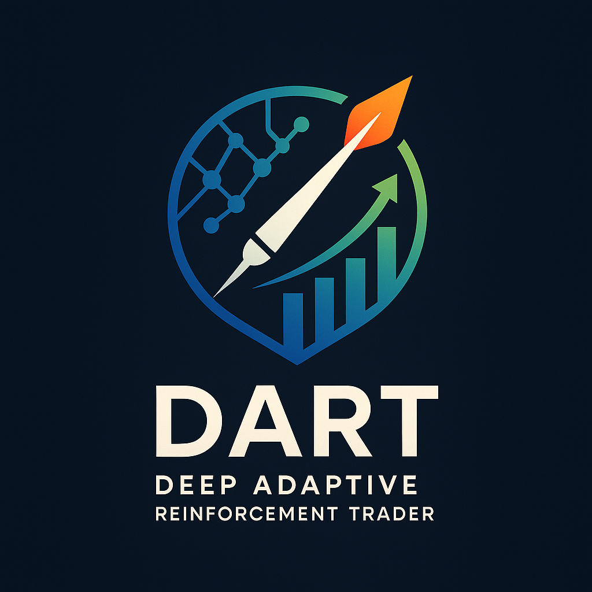
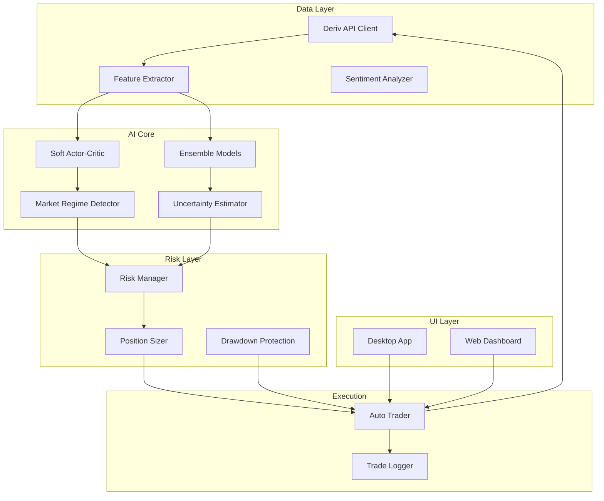

<p align="center">
  
</p>

<h1 align="center">D.A.R.T</h1>
<h3 align="center">Deep Adaptive Reinforcement Trader</h3>

<p align="center">
  <strong>An advanced AI-powered algorithmic trading system combining Deep Reinforcement Learning, ensemble machine learning, and sophisticated risk management.</strong>
</p>

<p align="center">
  
  
  
  
  
</p>

<p align="center">
  <a href="#-key-features">Features</a> •
  <a href="#-architecture">Architecture</a> •
  <a href="#-installation">Installation</a> •
  <a href="#-usage">Usage</a> •
  <a href="#-configuration">Configuration</a> •
  <a href="#-contributing">Contributing</a>
</p>

---

## 🌟 Overview

DART (Deep Adaptive Reinforcement Trader) is a sophisticated Python-based algorithmic trading platform that leverages cutting-edge AI technologies to analyze financial markets, generate trading strategies, and execute trades automatically. Built with a focus on adaptability and risk management, DART combines multiple ML paradigms to make intelligent trading decisions.

### What Makes DART Unique?

- **🧠 Hybrid AI Architecture**: Combines traditional ML ensembles with Deep Reinforcement Learning
- **📊 Multi-Modal Analysis**: Integrates technical indicators, price patterns, and market sentiment
- **🛡️ Institutional-Grade Risk Management**: Monte Carlo VaR, Kelly Criterion, and dynamic position sizing
- **🎯 Uncertainty-Aware Trading**: Epistemic and aleatoric uncertainty quantification for confident decisions
- **🔄 Self-Adaptive Learning**: Continuously improves from trade outcomes

---

## 🚀 Key Features

### 🤖 AI & Machine Learning

| Feature | Description |
|---------|-------------|
| **Soft Actor-Critic (SAC)** | State-of-the-art deep RL with automatic entropy tuning |
| **Ensemble Stacking** | Gradient Boosting + Random Forest + Logistic Regression meta-learner |
| **Market Regime Detection** | VAE-based detection of 7 market conditions (trending, volatile, ranging, etc.) |
| **Curiosity-Driven Exploration** | Intrinsic Curiosity Module (ICM) for better market exploration |
| **Uncertainty Quantification** | Ensemble disagreement + Monte Carlo dropout for confidence estimation |

### 📈 Technical Analysis

| Feature | Description |
|---------|-------------|
| **50+ Technical Indicators** | RSI, MACD, Bollinger Bands, ATR, ADX, Stochastic, CCI, MFI, VWAP, and more |
| **Market Structure Analysis** | Support/resistance levels, trend direction, volatility regimes |
| **Pattern Recognition** | Gap detection, trend strength calculation, price pattern identification |
| **Multi-Timeframe Analysis** | From 1-minute scalping to daily swing trading |

### 🛡️ Risk Management

| Feature | Description |
|---------|-------------|
| **Monte Carlo VaR** | Value at Risk with 10,000+ simulations at 95% and 99% confidence |
| **Kelly Criterion** | Optimal position sizing based on expected returns |
| **Dynamic Drawdown Protection** | Automatic trading pause on configurable drawdown thresholds |
| **Correlation-Based Limits** | Portfolio diversification with correlation exposure management |
| **Regime-Adjusted Sizing** | Position sizes adapt to detected market conditions |

### 💻 User Interfaces

| Interface | Description |
|-----------|-------------|
| **Desktop Application** | Modern CustomTkinter-based GUI with real-time charts and trading controls |
| **Web Dashboard** | Streamlit-powered dashboard with glassmorphism design and live AI insights |
| **API Integration** | Full Deriv.com API support for live trading and market data |

---

## 🏗️ Architecture

```
DART/
├── 🔌 api/                          # API Integration Layer
│   └── deriv_client.py              # Deriv API with trading, proposals, and account management
│
├── ⚙️ config/                        # Configuration
│   └── settings.py                  # API keys, trading parameters, and thresholds
│
├── 🧠 ml/                            # Machine Learning Core
│   ├── deep_rl_agent.py             # Soft Actor-Critic with attention & curiosity modules
│   ├── trading_ai.py                # Ensemble learning and strategy generation
│   ├── feature_extractor.py         # 50+ technical indicators and sentiment analysis
│   ├── risk_manager.py              # Monte Carlo VaR, Kelly criterion, position sizing
│   └── auto_trader.py               # Automated trade execution engine
│
├── 🎨 ui/                            # User Interfaces
│   ├── app.py                       # Main desktop application (1900+ lines)
│   ├── modern_dashboard.py          # Streamlit web dashboard with glassmorphism
│   ├── chart_styles.py              # Chart theming and visualization
│   └── ui_theme.py                  # Theme management (dark/light modes)
│
├── 🔧 utils/                         # Utilities
│   ├── api_utils.py                 # API helpers and error handling
│   └── timeframe.py                 # Timeframe conversions
│
├── 📁 models/                        # Saved ML models (runtime generated)
├── 📁 logs/                          # Trading logs and performance data
├── 📁 tests/                         # Unit and integration tests
│
├── 🚀 main.py                        # Desktop app entry point
├── 🚀 dart_launcher_new.py           # Alternative launcher with enhancements
└── 📋 pyproject.toml                 # Dependencies and project metadata
```

### Component Diagram



---

## 📦 Installation

### Prerequisites

- **Python 3.14+** (required)
- **[uv](https://github.com/astral-sh/uv)** - Fast Python package installer

### Quick Start

```bash
# 1. Clone the repository
git clone https://github.com/ItzSwapnil/DART.git
cd DART

# 2. Install uv (if not already installed)
# Windows (PowerShell)
curl -LsSf https://astral.sh/uv/install.ps1 | powershell

# macOS/Linux
curl -LsSf https://astral.sh/uv/install.sh | sh

# 3. Create virtual environment and install dependencies
uv venv .venv

# Activate (Windows)
.venv\Scripts\activate

# Activate (macOS/Linux)
source .venv/bin/activate

# 4. Install DART
uv pip install -e .

# 5. (Optional) Install deep learning extras
uv pip install -e ".[deep-learning]"
```

### Verify Installation

```bash
python -c "import torch; print(f'PyTorch: {torch.__version__}')"
python -c "from ml.trading_ai import TradingAI; print('DART AI: OK')"
```

---

## 🎮 Usage

### 🖥️ Desktop Application

```bash
# Launch the main application
python main.py

# Or use the enhanced launcher
python dart_launcher_new.py
```

**Quick Guide:**
1. Select a market from the dropdown (e.g., Volatility 75 Index)
2. Choose your timeframe (1 minute to 1 day)
3. Click **"Train Model"** to train AI on 7 days of historical data
4. Adjust the confidence threshold slider (higher = fewer but more confident trades)
5. Click **"Start Auto-Trading"** to begin automated trading
6. Monitor real-time performance in the trading dashboard

### 🌐 Web Dashboard

```bash
# Launch the Streamlit dashboard
streamlit run ui/modern_dashboard.py
```

The web dashboard features:
- Real-time AI insights with epistemic/aleatoric uncertainty display
- Interactive candlestick charts with technical indicators
- Live performance metrics and trade history
- Glassmorphism UI design with dark mode

### 📊 Sample Trading Session

```python
from ml.trading_ai import TradingAI
from api.deriv_client import DerivClient

# Initialize components
client = DerivClient(api_token="YOUR_TOKEN")
ai = TradingAI(use_deep_rl=True, use_enhanced_features=True)

# Get historical data and train
data = await client.get_historical_data("R_75", 60, days=7)
ai.train_model(data)

# Generate strategy
current_data = await client.get_candles("R_75", 60, count=100)
strategy = ai.generate_strategy(current_data)

print(f"Direction: {strategy['direction']}")
print(f"Confidence: {strategy['confidence']:.2%}")
print(f"Uncertainty: {strategy['uncertainty']:.4f}")
```

---

## ⚙️ Configuration

### API Setup (Required for Trading)

1. Create a [Deriv.com](https://deriv.com) account
2. Go to [API Token Page](https://app.deriv.com/account/api-token)
3. Create a token with: **Read, Trade, Payments, Admin, Trading information**
4. Update `config/settings.py`:

```python
DERIV_API_TOKEN = 'your_actual_token_here'
```

### Key Configuration Options

| Setting | Description | Default |
|---------|-------------|---------|
| `TRADE_AMOUNT` | Stake per trade | 1.0 |
| `MAX_DAILY_LOSS` | Daily loss limit | 50.0 |
| `CONFIDENCE_THRESHOLD` | Min confidence for trades | 0.65 |
| `TRAINING_DAYS` | Historical data for training | 7 |
| `MAX_CONSECUTIVE_LOSSES` | Losses before strategy recalc | 3 |

### Risk Management Settings

```python
# config/settings.py
MAX_PORTFOLIO_RISK = 0.02        # 2% portfolio risk per trade
MAX_DRAWDOWN_THRESHOLD = 0.15   # 15% max drawdown
VAR_CONFIDENCE_LEVELS = [0.95, 0.99]  # VaR confidence
```

---

## 🧰 Dependencies

### Core Dependencies

| Package | Purpose |
|---------|---------|
| `torch>=2.9.1` | Deep learning (SAC, neural networks) |
| `scikit-learn>=1.8.0` | Ensemble models, preprocessing |
| `pandas>=2.3.3` | Data manipulation |
| `numpy>=2.4.0` | Numerical computing |
| `ta>=0.11.0` | Technical analysis indicators |
| `python-deriv-api>=0.1.6` | Deriv.com API client |
| `customtkinter>=5.2.2` | Modern desktop UI |
| `streamlit>=1.52.0` | Web dashboard |
| `matplotlib>=3.10.8` | Chart visualization |
| `plotly>=6.5.1` | Interactive charts |

### Optional Dependencies

```bash
# Deep learning extras
uv pip install -e ".[deep-learning]"

# Development tools
uv pip install -e ".[dev]"

# Additional data sources
uv pip install -e ".[data-sources]"
```

---

## 📈 Performance & Metrics

DART tracks comprehensive performance metrics:

- **Win Rate**: Percentage of profitable trades
- **Sharpe Ratio**: Risk-adjusted returns
- **Sortino Ratio**: Downside risk-adjusted returns
- **Maximum Drawdown**: Largest peak-to-trough decline
- **Calmar Ratio**: Return/drawdown ratio
- **Value at Risk (VaR)**: 95% and 99% confidence
- **Expected Shortfall (CVaR)**: Tail risk measure

---

## 🛣️ Roadmap

### Completed ✅

- [x] Deep Reinforcement Learning (Soft Actor-Critic)
- [x] Ensemble ML with stacking meta-learner
- [x] Advanced risk management (VaR, Kelly, drawdown)
- [x] Market regime detection (7 regimes)
- [x] Uncertainty quantification
- [x] Web dashboard with Streamlit
- [x] Multi-modal feature extraction (50+ indicators)

### In Progress 🔄

- [ ] Pattern recognition (candlestick patterns)
- [ ] Backtesting framework
- [ ] Portfolio management (multi-position)

### Planned 📋

- [ ] Mobile app companion
- [ ] Social trading features
- [ ] News sentiment integration
- [ ] WebSocket real-time updates

---

## 🤝 Contributing

Contributions are welcome! Please follow these steps:

1. **Fork** the repository
2. **Create** a feature branch (`git checkout -b feature/amazing-feature`)
3. **Commit** your changes (`git commit -m 'Add amazing feature'`)
4. **Push** to the branch (`git push origin feature/amazing-feature`)
5. **Open** a Pull Request

### Development Setup

```bash
# Install dev dependencies
uv pip install -e ".[dev]"

# Run tests
pytest

# Code formatting
black .
ruff check .
```

---

## 📄 License

This project is licensed under the **MIT License** - see the [LICENSE](LICENSE) file for details.

---

## 🙏 Acknowledgments

- [Deriv API](https://api.deriv.com/) - Market data and trading infrastructure
- [PyTorch](https://pytorch.org/) - Deep learning framework
- [scikit-learn](https://scikit-learn.org/) - Machine learning library
- [TA Library](https://github.com/bukosabino/ta) - Technical analysis
- [Streamlit](https://streamlit.io/) - Web dashboard framework
- [uv](https://github.com/astral-sh/uv) - Fast Python package management

---

<p align="center">
  <strong>Built with ❤️ for the future of algorithmic trading</strong>
</p>

<p align="center">
  <a href="https://github.com/ItzSwapnil/DART/issues">Report Bug</a> •
  <a href="https://github.com/ItzSwapnil/DART/issues">Request Feature</a>
</p>
